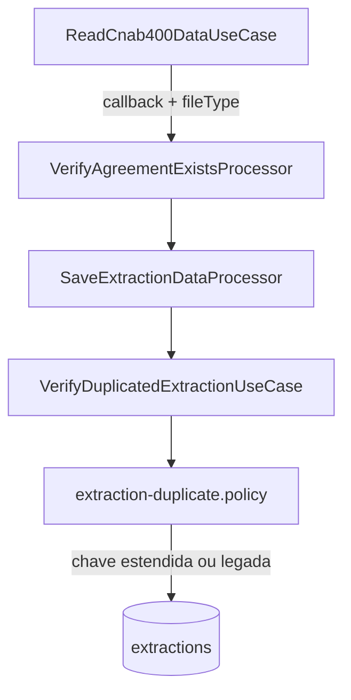

# Plano — Exceção de duplicidade no repasse (CNAB 400 BB)

## Contexto e decisão de negócio

**Problema:** No retorno CNAB 400 do Banco do Brasil, o mesmo título (`regional_number`) pode aparecer **duas vezes** no mesmo arquivo com ocorrências **`05` (Liquidação)** e **`06` (Baixa)** — um único pagamento, dois eventos de retorno.

**Comportamento atual:** [`VerifyDuplicatedExtractionUseCase`](C:\Users\dell\projects\s4s\mutua\modulo-prestacao-de-art-backend\src\core\use-cases\extraction\verify-duplicated\verify-duplicated-extraction.use-case.ts) considera duplicata apenas por `regionalNumber + agreementId`. A segunda linha é ignorada em [`SaveExtractionDataProcessor`](C:\Users\dell\projects\s4s\mutua\modulo-prestacao-de-art-backend\src\workers\processors\ret-file\save-extraction-data\save-extraction-data.processor.ts) quando `totalFare` da nova linha ≤ existente.

**Impacto:** Repasse de **R$ 21,67** por linha `05` (20% de R$ 108,39) não entra no 360; divergência com extrato BB.

**Decisão BB (confirmada):** Contabilizar a duplicidade — **ambos os eventos** (`05` e `06`) devem gerar extrações distintas para fins de repasse.

**Casos de referência:**

| Convênio       | Arquivo                       | Linhas                                              |
| -------------- | ----------------------------- | --------------------------------------------------- |
| `2810159` (PE) | `CBR64357991704202615758.ret` | 3260 (`06`, créd. 20/04) + 3262 (`05`, créd. 17/04) |
| `3398378` (TO) | `CBR6435715903202630827.ret`  | 436 (`06`) + 439 (`05`)                             |

Documentação de negócio já elaborada: [`file-watcher/docs/email-bb.md`](C:\Users\dell\projects\s4s\mutua\file-watcher\docs\email-bb.md).

---

## Arquitetura proposta



**Princípio:** Regra de negócio isolada em **policy** (padrão já usado em [`art-split.policy.ts`](C:\Users\dell\projects\s4s\mutua\modulo-prestacao-de-art-backend\src\core\use-cases\report\report-repasse-calculator\art-split.policy.ts)), com **constantes explícitas** para ligar/desligar por banco+layout — **sem variáveis de ambiente**.

---

## 1. Nova policy (núcleo)

**Criar** pasta e arquivos:

- [`src/core/policies/ret-file/extraction-duplicate.policy.constants.ts`](C:\Users\dell\projects\s4s\mutua\modulo-prestacao-de-art-backend\src\core\policies\ret-file\extraction-duplicate.policy.constants.ts)
- [`src/core/policies/ret-file/extraction-duplicate.policy.ts`](C:\Users\dell\projects\s4s\mutua\modulo-prestacao-de-art-backend\src\core\policies\ret-file\extraction-duplicate.policy.ts)
- [`src/core/policies/ret-file/extraction-duplicate.policy.spec.ts`](C:\Users\dell\projects\s4s\mutua\modulo-prestacao-de-art-backend\src\core\policies\ret-file\extraction-duplicate.policy.spec.ts)
- [`src/core/policies/ret-file/index.ts`](C:\Users\dell\projects\s4s\mutua\modulo-prestacao-de-art-backend\src\core\policies\ret-file\index.ts) (barrel export)

### Constantes (toggle sem env)

```typescript
/** Liga/desliga a exceção por banco + layout. NÃO usar process.env aqui. */
export const EXTRACTION_DUPLICATE_POLICY = {
  BB_CNAB_400: {
    /** BB confirmou: contabilizar 05 e 06 do mesmo título como extrações distintas. */
    enabled: true,
    separateDuplicateKeyByMovementType: true,
  },
  CEF_CNAB_240_40: {
    /** Divergências parecidas em análise — manter OFF até validação com Caixa. */
    enabled: false,
    separateDuplicateKeyByMovementType: true,
  },
  BB_CNAB_240_30: {
    enabled: false,
    separateDuplicateKeyByMovementType: false,
  },
} as const;
```

### API da policy

- `normalizeMovementType(raw?: string): string | null` — normaliza `'05'|'5' → '5'`, `'06'|'6' → '6'` (alinhado ao mapeamento em [`read-cnab-400-data.use-case.ts`](C:\Users\dell\projects\s4s\mutua\modulo-prestacao-de-art-backend\src\core\use-cases\ret-file\read-cnab-400-data.use-case.ts) L149).
- `isSeparateMovementTypeDuplicateKeyEnabled(ctx): boolean` — `ctx = { bank, fileType }`.
- `buildExtractionDuplicateWhere(ctx): Prisma.ExtractionWhereInput` — retorna:
  - **Policy ON:** `{ regionalNumber, agreementId, movimentType }`
  - **Policy OFF (legado):** `{ regionalNumber, agreementId }`

### Comentário obrigatório no topo do `.policy.ts`

Bloco `/** ... */` (10–15 linhas) com:

- Causa raiz (BB CNAB 400, ocorrências 05+06 mesmo título)
- Referência aos convênios `2810159` / `3398378`
- Link para doc técnica
- Aviso: **não remover sem alinhar com BB**
- Nota CEF: flag preparada, `enabled: false`

---

## 2. Propagar `fileType` no pipeline de fila

Hoje o payload [`HandleExtractionFileParams`](C:\Users\dell\projects\s4s\mutua\modulo-prestacao-de-art-backend\src\core\dtos\workers\read-ret-file.dto.ts) tem `bank: 'BB' | 'CEF'` mas **não** `fileType`. A exceção deve aplicar **somente** a `CNAB_400` + `BB`, não ao CNAB 240-30 BB.

**Alterar:**

1. [`read-ret-file.dto.ts`](C:\Users\dell\projects\s4s\mutua\modulo-prestacao-de-art-backend\src\core\dtos\workers\read-ret-file.dto.ts) — adicionar `fileType?: RetFileTypeEnum` em `ExtractionFileDataResponse` e `HandleExtractionFileParams`.
2. [`extract-ret-file-data.use-case.ts`](C:\Users\dell\projects\s4s\mutua\modulo-prestacao-de-art-backend\src\core\use-cases\ret-file\extract-ret-file-data.use-case.ts) — no `verify(bank)`, incluir `fileType` no `fullData` (closure captura `fileType` do `execute`).

Nenhuma mudança nos readers CNAB além do que já propagam via callback; o `fileType` vem do use case pai.

---

## 3. Estender `VerifyDuplicatedExtractionUseCase`

**Arquivo:** [`verify-duplicated-extraction.use-case.ts`](C:\Users\dell\projects\s4s\mutua\modulo-prestacao-de-art-backend\src\core\use-cases\extraction\verify-duplicated\verify-duplicated-extraction.use-case.ts)

**Antes:**

```typescript
findFirst({ where: { regionalNumber, agreementId } });
```

**Depois:**

```typescript
interface VerifyDuplicatedExtractionParams {
  regionalNumber: string;
  agreementId: number;
  movimentType?: string | null;
  bank?: 'BB' | 'CEF';
  fileType?: RetFileTypeEnum;
}

execute(params) {
  const where = buildExtractionDuplicateWhere({
    regionalNumber: params.regionalNumber,
    agreementId: params.agreementId,
    movimentType: normalizeMovementType(params.movimentType),
    bank: params.bank,
    fileType: params.fileType,
  });
  return findFirst({ where });
}
```

**Criar** [`verify-duplicated-extraction.use-case.spec.ts`](C:\Users\dell\projects\s4s\mutua\modulo-prestacao-de-art-backend\src\core\use-cases\extraction\verify-duplicated\verify-duplicated-extraction.use-case.spec.ts) com casos:

| Cenário         | Policy | Existe `06` | Busca `05`         | Resultado                |
| --------------- | ------ | ----------- | ------------------ | ------------------------ |
| BB CNAB_400     | ON     | sim         | sim                | **null** (não duplicata) |
| BB CNAB_400     | ON     | sim         | sim (`06` de novo) | duplicata                |
| BB CNAB_240_30  | OFF    | sim         | sim (`05`)         | duplicata (legado)       |
| CEF CNAB_240_40 | OFF    | sim         | sim                | duplicata (legado)       |

---

## 4. Ajustar `SaveExtractionDataProcessor`

**Arquivo:** [`save-extraction-data.processor.ts`](C:\Users\dell\projects\s4s\mutua\modulo-prestacao-de-art-backend\src\workers\processors\ret-file\save-extraction-data\save-extraction-data.processor.ts)

Passar contexto completo ao verify:

```typescript
await this.verifyDuplicatedExtractionUseCase.execute({
  regionalNumber: payload.details.regionalNumber,
  agreementId: agreement.id,
  movimentType: payload.details.transactionType,
  bank: payload.bank,
  fileType: payload.fileType,
});
```

**Regra de tarifa maior permanece inalterada** — só se aplica quando a policy considera duplicata (mesma chave). Com chave estendida, `05` após `06` **cria nova extração** sem passar pelo branch de ignore/update.

**Novos testes** em [`save-extraction-data.processor.spec.ts`](C:\Users\dell\projects\s4s\mutua\modulo-prestacao-de-art-backend\src\workers\processors\ret-file\save-extraction-data\save-extraction-data.processor.spec.ts):

- `BB + CNAB_400`: primeira linha `06`, segunda `05` (tarifa menor) → **`createExtraction` 2×**, sem `duplicateIgnored`.
- `BB + CNAB_240_30`: segunda linha mesmo regional → ainda **`duplicateIgnored`** (regressão).

---

## 5. Documentação técnica (obrigatória)

**Criar** [`docs/technical/ret-file-duplicate-extraction-policy.md`](C:\Users\dell\projects\s4s\mutua\modulo-prestacao-de-art-backend\docs\technical\ret-file-duplicate-extraction-policy.md) com:

1. **Resumo executivo** (1 parágrafo)
2. **Glossário** — `05`, `06`, `regional_number`, repasse 20%
3. **Fluxo antes/depois** (diagrama mermaid)
4. **Tabela de toggles** (`EXTRACTION_DUPLICATE_POLICY`)
5. **Casos reais** (PE 17/04, TO 10/03) com linhas de arquivo
6. **Como desligar** a exceção (alterar `enabled: false` em constants — rebuild/deploy)
7. **CEF** — seção "futuro" com flag `CEF_CNAB_240_40.enabled`
8. **Reprocessamento histórico** — fora do escopo desta entrega; ver fase 2 abaixo
9. Link cruzado para [`ret-file-dashboard-sql.md`](C:\Users\dell\projects\s4s\mutua\modulo-prestacao-de-art-backend\docs\technical\ret-file-dashboard-sql.md) (crédito oficial por `total_value`)

**Opcional mas recomendado:** regra Cursor [`.cursor/rules/ret-file-duplicate-policy.mdc`](C:\Users\dell\projects\s4s\mutua\modulo-prestacao-de-art-backend.cursor\rules\ret-file-duplicate-policy.mdc) com `globs: **/extraction-duplicate*.ts,**/verify-duplicated*.ts,**/save-extraction-data.processor.ts` apontando para a doc.

---

## 6. O que NÃO mudar nesta entrega

| Item                                       | Motivo                                                      |
| ------------------------------------------ | ----------------------------------------------------------- |
| `read-cnab-400` accepted codes             | `05` e `06` já são lidos                                    |
| SQL de repasse (`CAST(total_value * 0.2)`) | Já recalcula por linha; nova extração entra automaticamente |
| Índice único no Prisma                     | Duplicidade é lógica de aplicação; sem migration            |
| Reprocessamento março/abril                | Fase 2 separada                                             |
| `file-watcher`                             | Mudança é só no backend de ART                              |

---

## 7. Fase 2 (fora do escopo imediato — documentar no plano)

Após deploy da policy, dados históricos **não** ganham linhas `05` automaticamente.

**Opções para follow-up:**

1. Reimportar arquivos afetados (`CBR64357991704202615758.ret`, `CBR6435715903202630827.ret`, etc.)
2. Script de backfill que lê retorno e insere apenas linhas `05` faltantes (com mesma policy)
3. Query de auditoria: contar linhas `05` em arquivos vs `moviment_type = '5'` em `extractions`

Validar PE **17/04/2026** e TO **10/03/2026** pós-reprocessamento contra extrato BB.

---

## 8. Verificação (critérios de aceite)

1. **Unit:** `extraction-duplicate.policy.spec.ts` — toggles BB ON / CEF OFF.
2. **Unit:** `verify-duplicated-extraction.use-case.spec.ts` — chave estendida.
3. **Unit:** `save-extraction-data.processor.spec.ts` — cenário 06+05 BB CNAB_400 cria 2 registros.
4. **Manual (pós-deploy):** reprocessar `CBR64357991704202615758.ret`; conferir:
   - 2 extrações para regional `28101598308709825` (`moviment_type` `6` e `5`)
   - Repasse PE 17/04 + **R$ 21,67** vs baseline anterior
5. **Regressão:** CNAB 240-30 BB e CNAB 240-40 CEF mantêm comportamento legado com policy OFF.

---

## 9. Arquivos tocados (resumo)

| Ação             | Arquivo                                                                                         |
| ---------------- | ----------------------------------------------------------------------------------------------- |
| Criar            | `src/core/policies/ret-file/extraction-duplicate.policy.constants.ts`                           |
| Criar            | `src/core/policies/ret-file/extraction-duplicate.policy.ts`                                     |
| Criar            | `src/core/policies/ret-file/extraction-duplicate.policy.spec.ts`                                |
| Criar            | `src/core/policies/ret-file/index.ts`                                                           |
| Criar            | `docs/technical/ret-file-duplicate-extraction-policy.md`                                        |
| Criar            | `.cursor/plans/excecao-duplicidade-repasse-bb-cnab400.plan.md` (cópia deste plano)              |
| Criar (opcional) | `.cursor/rules/ret-file-duplicate-policy.mdc`                                                   |
| Editar           | `src/core/dtos/workers/read-ret-file.dto.ts`                                                    |
| Editar           | `src/core/use-cases/ret-file/extract-ret-file-data.use-case.ts`                                 |
| Editar           | `src/core/use-cases/extraction/verify-duplicated/verify-duplicated-extraction.use-case.ts`      |
| Criar            | `src/core/use-cases/extraction/verify-duplicated/verify-duplicated-extraction.use-case.spec.ts` |
| Editar           | `src/workers/processors/ret-file/save-extraction-data/save-extraction-data.processor.ts`        |
| Editar           | `src/workers/processors/ret-file/save-extraction-data/save-extraction-data.processor.spec.ts`   |

---

## Ordem de implementação sugerida

1. Policy + constants + specs da policy
2. Propagar `fileType` no DTO e `extract-ret-file-data`
3. `VerifyDuplicatedExtractionUseCase` + spec
4. `SaveExtractionDataProcessor` + spec
5. Documentação técnica + rule Cursor
6. Salvar plano em `.cursor/plans/`
7. (Fase 2) Reprocessamento e validação com BB
